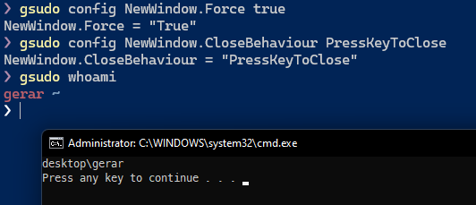

As mentioned in [Security Considerations](../security.md#what-are-the-risks-of-running-gsudo), elevation in the same console exposes a mild risk. You can avoid it altogether by elevating in a new console window, for example by adding the `--new` or `-n` switch.

In gsudo v2, a new setting was introduced to force elevations in a new window. To enable it simply run:

``` powershell
gsudo config NewWindow.Force true
```

The problem with this approach is that some elevations complete too quickly and the new window may close abruptly. So to leave time to verify the window result, combine it with one of the following new switches:

- `--KeepWindow`: After running a command in a new console, ask for keypress before closing the console/window.
- `--KeepShell`: After running a command, keep the elevated shell open.

You set one of those switches permanently by using the following setting:

``` powershell
gsudo config NewWindow.CloseBehaviour [ KeepShellOpen | PressKeyToClose | OsDefault ]
```

Valid values are:
  - **KeepShellOpen**: Forces `--keepShell`. Keep the elevated shell open after running the command.
  

  - **PressKeyToClose**: Forces `--keepWindow`. Asks for a keypress before closing the window.  
  

  - **OsDefault**: (default) Launch the command and let the operating system close it or keep it according to the system defaults (typically the window will close).
